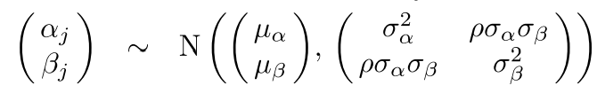
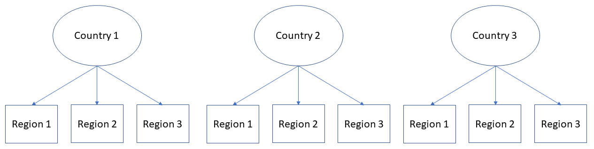
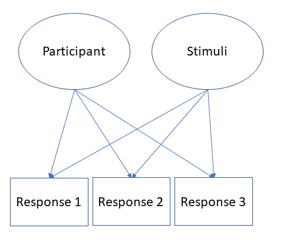

class: center, inverse
background-image: url("SumerianStand2.jpg")
background-size: contain
---

<style type="text/css">
body, td {
   font-size: 15px;
}
code.r{
  font-size: 15px;
}
pre {
  font-size: 20px
}
.huge .remark-code { /*Change made here*/
  font-size: 200% !important;
}
.tiny .remark-code { /*Change made here*/
  font-size: 80% !important;
}


</style>

## Press record

---
## Intended aims

- Motivate usage of mixed-effect models, argument differences between types of pooling and explain how multilevel models differ from linear regression models

- Build a mixed-effect model in R environment with different random adjustments, estimate and interpret the coefficients

- Derive specific level estimate and evaluate the fit of the model

---
## Regression
Gaussian distribution:
$y_{i} \sim \mathcal{N^{iid}}(\mu_{i},\sigma)$ <br/> <br/>
$\mu_{i} = \alpha+\beta*x_i$ <br/><br/> 
Model mean and standard deviation <br/> <br/> 
<br/>
<br/>
a) Errors: $\mathcal{N}^{iid}(0,\sigma)$ <br/> <br/>
b) Linearity and additivity <br/> <br/>
c) Validity <br/> <br/>
d) Lack of perfect multicolinearity <br/> <br/>

---

## Correlated observations

Nested structures: observations nested hierarchically under general groups (eg. answers of pupils in the UK) <br/>
 - Pupils are nested in ther classes < schools < counties <br/> <br/>
 
Repeated measurements: observations clustered within the participants <br/> 
- Participants answering on a number of questions in an experiment <br/>
- NBA players contributing multiple observations of their performance throughout their career <br/><br/>

Clustering of the observations that are not nested: <br/>
- Questionnaire that collects profession of people and their country <br/> <br/>
---

## Multilevel models 

Generalization of regression $(y_i=\alpha+\beta*x_i+\epsilon_i)$, where we allow adjustments of: <br/><br/>
- Intercept: $y_i = \alpha_{j[i]}+\beta*x_i+\epsilon_i$ <br/><br/>
- Slope: $y_i=\alpha*\beta_{j[i]}*x_i+\epsilon_i$ <br/><br/>
- Both: $y_i=\alpha_{j[i]}*\beta_{j[i]}*x_i+\epsilon_i$<br/><br/>
<br/><br/>
Visualisation of the idea: [Link](http://mfviz.com/hierarchical-models/)
---

## How to understand multilevel models

1. __Complete pooling__ - take into account all observations, without categorical information <br/><br/>
2. __No pooling__ - adjust regression for each category  <br/> <br/>
3. __Partial pooling__ - use categories to adjust individual estimates <br/> <br/>

```{r, echo=FALSE, warning=FALSE, message=FALSE}
set.seed(456)
#Fixed effects
alpha_0 <-500 #intercept
beta_1 <-50 #slope 
sigma <- 100 #sd

# by-intercept sd, by_slope sd and correlation between intercept and slope sd
tau_0 <- 30 # by-group random intercet (countries)

tau_1 <- 30 # by-group random slope (countries)
rho <- 0

n_babies<-10

n_rfx <- faux::rnorm_multi(
    n=n_babies,
    mu = 0,
    sd = c(tau_0, tau_1),
    r = rho,
    varnames = c('T_0s','T_1s')
)

babies_rfx=data.frame(T_0s=rep(n_rfx$T_0s, each=200), T_1s=rep(n_rfx$T_1s, each=200))

Babies <- data.frame(Babies_id = rep(1:10, each=200),
                     babies_rfx)

Babies$Age=round(runif(2000,1,30))
Babies$Surounding=rnorm(2000,Babies$T_0s,20)
Babies$Weight=rnorm(2000,20,10)
Babies$CalorieIntake=alpha_0 + Babies$T_0s+(beta_1+Babies$T_1s)*Babies$Age+4*Babies$Surounding+5*Babies$Weight+rnorm(2000,0,sigma)
```

```{r, warning=FALSE, message=FALSE}
knitr::kable(head(Babies), format = 'html')
```
---
## Complete pooling

Linear model where we ignore information about the countries: 

```{r}
mod1CP<-lm(CalorieIntake~Age, data=Babies)
summary(mod1CP)
```

```{css, echo=FALSE}
pre {
  max-height: 300px;
  overflow-y: auto;
}

pre[class] {
  max-height: 100px;
}
```

```{css, echo=FALSE}
.scroll-100 {
  max-height: 100px;
  overflow-y: auto;
  background-color: inherit;
}
```
---

## Complete pooling

Looking at residuals:

```{r, fig.width=12, fig.height=5, fig.align='center'}
par(mfrow=c(1,1), bty='n',mar = c(5, 4, .1, .1), cex=1.1, pch=16)
plot(resid(mod1CP)[1:200], ylab='Residuals', xlab='Index')
```

---

## No pooling

Linear model where we estimates parameters for each country separately:  

```{r}
mod1NP<-lm(CalorieIntake~Age+factor(Babies_id)-1, data=Babies)
summary(mod1NP)
```

---

## No pooling

```{r, fig.width=12, fig.height=5, fig.align='center'}
par(mfrow=c(1,1), bty='n',mar = c(5, 4, .1, .1), cex=1.1, pch=16)
plot(resid(mod1NP)[1:200], ylab='Residuals',xlab='Index')
```

---

## Trade-off between the two approaches

_Complete pooling_ ignores variation between the categorical outcomes <br/> <br/>

_No pooling_ can overfit the data within each group, especially in the case when there are few observations per group or extreme cases <br/> <br/> <br/> <br/>

__Multilevel model (partial pooling)__<br/>

Multilevel estimates for a given country $j$ can be approximated as a weighted average of the mean of observations in the country (the unpooled estimate, $y_j$) and the mean over all countries (completely pooled estimate $y_{all}$) <br/> <br/>

---

## Shrinkage estimator 

Averages from countries with smaller sample size cary less information, and the weighting pulls multilevel estimates closer to the overall average. <br/>
If the $n_j=0$ then overal average <br/><br/>

Averages from countries with larger sample size carry more information, and the multilevel estimates are close to the country averages. <br/>
If $n_j->\infty$ then country average <br/><br/>

Every other time, multilevel estimates are between the two extremes <br/>

---

## Multilevel model: intercept

$$y_i \sim N(\alpha_{j[i]}+\beta*x_i, \sigma_y)$$ 
Estimation: $\alpha_j \sim N(\mu_\alpha, \sigma_\alpha)$ <br/>
--
```{r, warning=FALSE, message=FALSE}
#install.packages('lme4')
require(lme4)

mult1<-lmer(CalorieIntake~Age+(1|Babies_id), data=Babies)
summary(mult1)
```

---

## Multilevel model: intercept and slope adjustments 

$$y_i \sim N(\alpha_{j[i]}+\beta_{j[i]}*x_i, \sigma^2_y)$$ 
Distributional assumptions:

```{r, echo=FALSE, out.width = '40%',fig.align='center'}

```
--
```{r}
mult2<-lmer(CalorieIntake~Age+(1+Age|Babies_id), data=Babies)
summary(mult2)
```

---
## Comparison of residuals

```{r, fig.width=12, fig.height=5, fig.align='center'}
par(mfrow=c(1,3), bty='n',mar = c(5, 4,1, .1), cex=1.1, pch=16)
plot(resid(mod1CP)[1:200], ylab='Residuals',xlab='Index', main='Complete pooling')
plot(resid(mod1NP)[1:200], ylab='Residuals',xlab='Index', main='No pooling')
plot(resid(mult2)[1:200], ylab='Residuals',xlab='Index', main='Partial pooling')
```
---

## Fixed and random effects

Many different definitions: [LINK](https://stats.stackexchange.com/questions/4700/what-is-the-difference-between-fixed-effect-random-effect-and-mixed-effect-mode) <br/>

```{r}
fixef(mult2)
```

```{r}
ranef(mult2)
```
---
## Intra-class correlation (ICC)

How strongly units withing the group correlate with each other

$\frac{\sigma^2_{\alpha}}{\sigma^2_{\alpha}+\sigma^2_y} = \frac{132275}{132275+64118}=0.673522$

<br/><br/>

Works for only intercept random effect models

```{r}
mod1<-lmer(CalorieIntake~Age+(1|Babies_id), data=Babies)
performance::icc(mod1)
```

---

## Why multilevel modelling

1. Helps us with better inference about fixed effects <br/>
2. Interest in between group effects <br/>
3. Better inferences about levels of group not included in the sample <br/>
4. Deals better with the non-normality of outcomes <br/>
5. Deals better with outliers (shrinks them towards the mean)  <br/>
6. Deals better with unequal number of observations per group <br/><br/>
<br/><br/>

When is multilevel model equal to linear regression: <br/>

- Very little group-level variation - complete pooling <br/>

- Too much group-level variation - no pooling

???
How many groups/observations? - understanding partial pooling as a compromise between complete and no pooling indicates that the discussion about exact number of groups and observations is misguided. With few groups, we get classical regression - complete pooling and our multilevel model should be at least as good as linear regression. Having only two observations per group or even one observation in most of the groups might result in imprecise estimate of between group variance, but it should provide partial information that allows better estimation of parameters. 

---
class: inverse, middle, center
# Random effect structure 
---
## Specification of the structure

In all R packages, random effect structure can be specified using: <br/><br/>

object <- lmer(Dependent ~ Fixed (predictor) + __(1+|...)__, data=data) <br/><br/>

- (1|Factor) = intercept adjustments for each level of factor <br/><br/>
- (1+Predictor|Factor) = Intercept for each level of factor and slope adjustment for Predictor for each level of factor <br/><br/>
- (0 + Predictor|Factor) or (Predictor - 1|Factor) = Slope adjustment for Predictor for each level of factor <br/><br/>


???
LMERs cheat sheet: <br/><br/> 
- [LINK 1](https://stats.stackexchange.com/a/13173) <br/><br/>
- [LINK 2](https://stats.stackexchange.com/a/61466)

---

## Nested effects

```{r, echo=FALSE, out.width = '80%',fig.align='center'}

```
 <br/><br/>
 
Random effect specification: (1|Country/Region) <br/><br/>
Responses are nested within regions, that are further nested within Countries <br/><br/> 

---

## Crossed random effects

```{r, echo=FALSE, out.width = '40%',fig.align='center'}

```

Random effect specification: (1|Country) + (1|Region) <br/>
Responses have multimembership status, they are nested in a combination of countries  <br/> 

In the experimental situations (psycholinguistics): this will be the case. Responses in experimental paradigm are nested in two random structures simultaneously: participants and stimuli 

---

## How to decide what to include

There are no recipes, except that you need to think about your model and what it does <br/>

There is some advice from the experts and it is that we should keep it maximal! [LINK](https://talklab.psy.gla.ac.uk/KeepItMaximalR2.pdf) <br/> <br/>
However, this is not always possible <br/>

???
What happens when you have singular or convergence issues: [link](https://stats.stackexchange.com/questions/110004/how-scared-should-we-be-about-convergence-warnings-in-lme4) <br/> <br/>

Additional information on random effects: [link](https://rpsychologist.com/r-guide-longitudinal-lme-lmer)

---

## Significance testing: fixed effects

```{r, warning=FALSE, message=FALSE}
#install.packages('lmerTest')
require(lmerTest)
mult2<-lmer(CalorieIntake~Age+(1+Age|Babies_id), data=Babies)
print(summary(mult2), cor=F)
```

???
REML: [LINK](https://towardsdatascience.com/maximum-likelihood-ml-vs-reml-78cf79bef2cf) <br/><br/> 

Satterweight approximation of degrees of freedom: [LINK](https://link.springer.com/article/10.3758/s13428-016-0809-y)
---

## Significance testing: random effects 

We are not interested in understanding exactly which levels of random factors are different in comparison to the mean <br/><br/> 

We are interested in making correct estimates of our coefficients <br/><br/> 

However, we can compare whether random structure adds more information by comparing the nested models <br/>

---
class: inverse, middle, center
# Practical aspect
---

## Data

Relation between digital-screen use and the mental well-being of adolescents: [LINK](https://journals.sagepub.com/doi/10.1177/0956797616678438)  <br/> <br/>
.pull-left[
Outcome:
- Mental well-being: mwbi  <br/><br/><br/>

Predictors:
- TV weekdays: Watchwk_adj  <br/>
- TV weekends: Watchwe_adj  <br/>
- Computer weekdays: Compwk_adj  <br/>
- Computer weekends: Compwe_adj  <br/>
- Smartphones weekday: Smartwk_adj  <br/>
- Smartphones weekends: Smartwe_adj  <br/>
- Total: sum of those
]
.pull-right[
Ethnicity: Ethnicg <br/> 
Region: Region <br/>
Local area: LANAME <br/><br/><br/>

Factors:
male <br/>
minority <br/>
deprived <br/>
]

---

## Reading the data in R

```{r, warning=FALSE, message=FALSE}
#install.packages('foreign')
require(foreign)
mwell<-read.spss('data.sav', to.data.frame = T)
dim(mwell)
mwell$Total=mwell$Watchwe_adj+mwell$Watchwk_adj+mwell$Comphwe_adj+mwell$Comphwk_adj+mwell$Smartwe_adj+mwell$Smartwk_adj
```

---


## Missing data

Outcome:

```{r}
table(is.na(mwell$mwb))
```

Predictor: 

```{r}
table(is.na(mwell$Watchwk))
```

---

## Visualisations of the raw data

```{r, fig.width=12, fig.height=5, fig.align='center'}
par(mfrow=c(1,2), bty='n',mar = c(5, 4, .1, .1), cex=1.1,pch=16)
plot(density(mwell$mwb, na.rm=TRUE), main='')
plot(density(mwell$Total, na.rm = T), main='')
```

---

## Subsetting the data - excluding NAs

```{r}
mwell2=mwell[!is.na(mwell$mwb) & !is.na(mwell$Total),]
dim(mwell2)
```
---

## Scatter plots

```{r, fig.width=12, fig.height=5, fig.align='center'}
cor(mwell2$mwb, mwell2$Total)
par(mfrow=c(1,1), bty='n',mar = c(5, 4, .1, .1), cex=1.1,pch=16)
plot(mwell2$Total[1:500], mwell2$mwb[1:500])
```

---

## Observations for each category

```{r}
table(mwell2$Ethnicg)
table(mwell2$REGION)
```

---

## Observation for each category

```{r}
table(mwell2$LANAME)[1:10]
```

---

## Building the model: Random structure 1 

```{r}
MWmod1<-lmer(mwb~(1|LANAME), data=mwell2)
MWmod2<-lmer(mwb~(1|LANAME)+(1|Ethnicg), data=mwell2)
MWmod3<-lmer(mwb~(1|REGION/LANAME)+(1|Ethnicg), data=mwell2)
anova(MWmod1, MWmod2, MWmod3)
```

---

## Building the model: Fixed structure 1

```{r}
MWmod2a<-lmer(mwb~Total+(1|LANAME)+(1|Ethnicg), data=mwell2)
print(summary(MWmod2a), cor=F)
```

---

## Building the model: Fixed structure 2

```{r}
MWmod2b<-lmer(mwb~Total+male+(1|LANAME)+(1|Ethnicg), data=mwell2)
MWmod2c<-lmer(mwb~Total*male+(1|LANAME)+(1|Ethnicg), data=mwell2)
anova(MWmod2a, MWmod2b, MWmod2c)
```

---

## Results: Fixed structure 2

```{r}
print(summary(MWmod2c), cor=F)
```

---

## Building the model: Random structure 2

```{r}
MWmod3c<-lmer(mwb~Total*male+(1+Total|LANAME)+(1|Ethnicg), data=mwell2)
```

```{r}
MWmod3c<-lmer(mwb~Total*male+(1|LANAME:male)+(1|Ethnicg), data=mwell2)
anova(MWmod2c, MWmod3c)
```

---

## Building the model: Random structure 3

```{r}
MWmod3c<-lmer(mwb~Total*male+(1|LANAME)+(1|Ethnicg:male), data=mwell2)
anova(MWmod2c, MWmod3c)
```

---

## Results: Full structure

```{r}
summary(MWmod3c)
```

---

## Visualisation of the random structure: 1

```{r, warning=FALSE, message=FALSE, fig.width=12, fig.height=5, fig.align='center'}
require(sjPlot)
plot_model(MWmod3c, type='re', sort.est='sort.all', grid=FALSE)[1]
```

---

## Visualisation of the random structure: 2

```{r , fig.width=12, fig.height=5, fig.align='center'}
plot_model(MWmod3c, type='re', sort.est='sort.all', grid=FALSE)[2]
```

---

## Visualisation of the fixed effects

```{r, warning=FALSE, message=FALSE, fig.width=12, fig.height=5, fig.align='center'}
plot_model(MWmod3c, type='int')
```

---

## Additional information - here be dragons

Significance of the random structure

```{r}
ranova(MWmod3c)
```

Explained variance - R2:

```{r, warning=FALSE, message=FALSE}
#install.packages('MuMIn')
require(MuMIn)
r.squaredGLMM(MWmod3c)
```

---

## Prediction of the model

```{r, fig.width=12, fig.height=5, fig.align='center'}
mwell2$predicted=predict(MWmod3c)
par(mfrow=c(1,1), bty='n',mar = c(5, 4, .1, .1), cex=1.1,pch=16)
plot(mwell2$predicted, mwell2$mwb)
```

---
## Important aspects: theory

- Why and when would we want to use multilevel models <br/>
- What can we include in our random structure - types of adjustments <br/>
- Multilevel models versus complete and no pooling <br/>
- Understanding how to specify random structure

---

## Important aspects: practice

- Building linear mixed-effect model
- Specifying random intercepts and slopes
- Comparing nested models 
- Interpreting coefficients from linear mixed-effect models

---
## Literature

Chapter 11, 12 and 13 of "Data Analysis Using Regression and Multilevel/Hierarchical Models" by Andrew Gelman and Jennifer Hill <br/> <br/>


---

# Thank you for your attention
